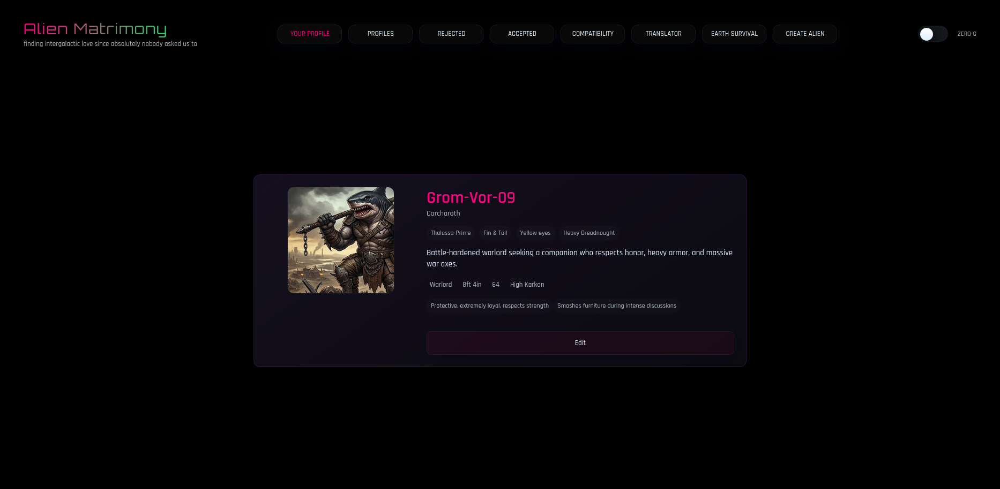
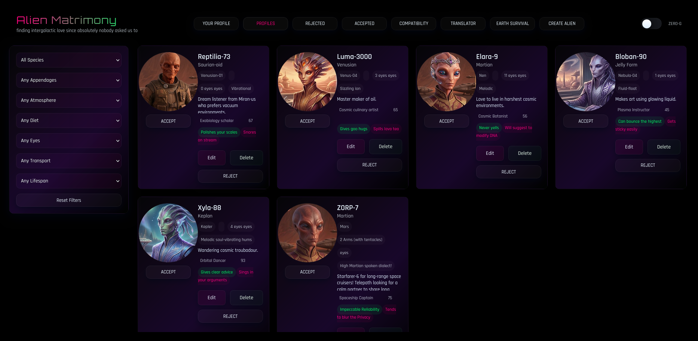
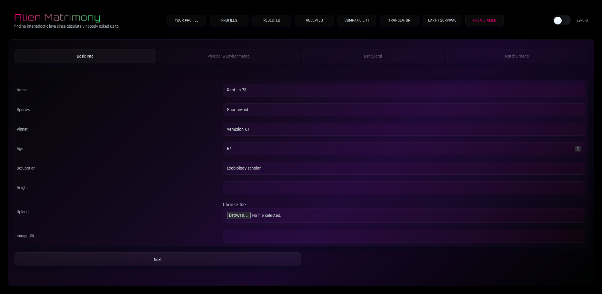
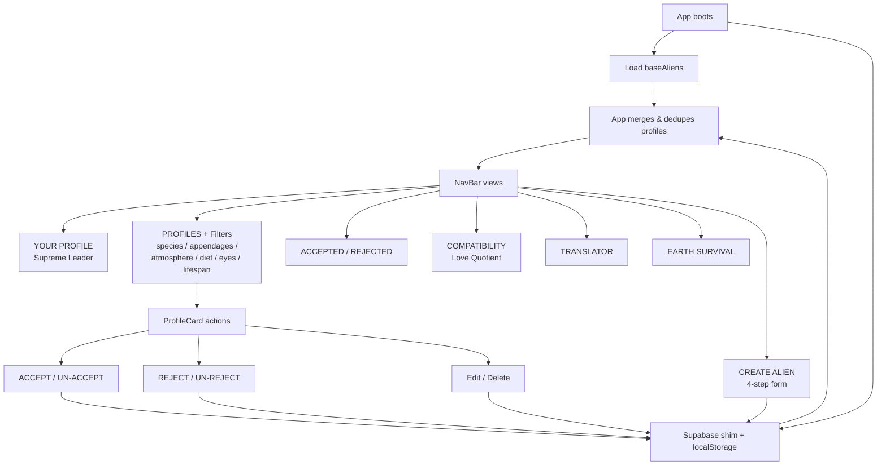

# Alien Matrimony 🎯


## Basic Details
### Team Name: HackHer

### Team Members
- Team Lead: Shika p s - Ahalia School of Engineering & Technology, Palakkad
- Member 2: Femina k - Ahalia School of Engineering & Technology, Palakkad

### Project Description
Alien Matrimony serves as the official intergalactic match-making registry maintained under the absolute authority of the Supreme Leader of the Universe. Filter planetary subjects by species, appendages, atmosphere etc or command the compatibility engine to dictate optimal interspecies unions across the cosmos, because managing intergalactic romance is a sacred admin duty, even since absolutely nobody asked us to.

### The Problem (that doesn't exist)
We have no proof aliens exist, but if they do, intergalactic romantic chaos is inevitable. Without supreme intervention, oxygen-breathers will keep dating vacuum-dwellers, plasma-eaters will clash with rock-munchers, and zero-G dates will turn into orbital disasters—a cosmic crisis nobody asked us to solve, yet here we are.

### The Solution (that nobody asked for)
To avert total cosmic dating catastrophe, the Supreme Leader personally authorized Alien Matrimony—the universe's premier intergalactic registry. Equipped with rigorous filtering algorithms, custom subject profiles, an immediate Universal Translator, an Interspecies Compatibility Engine, an Earth Survival Rate estimator, and a built-in Zero-Gravity Toggle, this platform ensures every cosmic union is strictly regulated, surprisingly compatible, and administratively approved.

## Technical Details
### Technologies/Components Used
For Software:
- **Language/Stack:** JavaScript (ES6+), CSS3, HTML5
- **Framework:** React 18 (react ^18.3.1, react-dom ^18.3.1)
- **Data/Persistence:** Supabase API (lightweight localStorage-backed shim ships with the app so it works with zero backend), Browser APIs (`localStorage`, `FileReader`, `CustomEvent`)
- **Styling:** Vanilla CSS3 (custom neon/sci-fi design system, Orbitron + Rajdhani fonts)
- **Build tooling:** Vite 5, npm, Git & GitHub
- **Dev tools:** VS Code, Gemini, ChatGPT, Mozilla Firefox

### Implementation
For Software:

# Installation
```bash
git clone https://github.com/shikaaps/TinkerHub.git
cd TinkerHub
npm install
```

# Run
```bash
npm run dev          # start Vite dev server (http://localhost:5173)
```

# Build (production)
```bash
npm run build        # outputs static bundle to ./dist
npm run preview      # local preview of the built bundle
```

### Project Documentation
For Software:

The app boots as a single-page registry. On load it merges the 6 base subject profiles (`src/data/aliens.js`) with subjects created locally and any stored via the Supabase shim (`src/supabaseClient.js`). All creation/accept/reject/update data persists through `localStorage` so the Supreme Leader's edicts survive refreshes.

# Screenshots


*The PROFILES registry: grid of subject profile cards (avatar, home planet, appendages, eye count, transport, bio, green/red flags) beside the filter sidebar — species, appendages, atmosphere, diet, eyes, transport and lifespan.*


*The COMPATIBILITY engine: pick two subjects and get their "Love Quotient" score (18–99%) with a detailed readout of why the union is (or isn't) administratively approved.*


*The CREATE ALIEN multi-step intake form (Basic Info → Physical & Environmental → Behavioral → Match Criteria) with image upload, along with the ZERO-G toggle, ACCEPTED/REJECTED tabs and the system-message toast.*
*Bonus subjects to shoot: the UNIVERSAL TRANSLATOR (glitch-garble any text + confidence %) and the EARTH SURVIVAL estimator (atmosphere/gravity/social/adaptability/danger breakdown).*

# Diagrams



*Workflow: single-page React app — data is merged from local base profiles plus persisted storage, then filtered and displayed; every admin action (accept, reject, create, edit, delete) writes back through the persistence shim.*

N/A for Hardware — this is a software-only project (no physical build).

### Project Demo
# Video
[Add your demo video link here]
*Demo should walk through: browsing + filtering the registry, accepting/rejecting subjects, running a compatibility match, translating a message, estimating Earth survival, creating an alien, and flipping the ZERO-G toggle.*

# Additional Demos
[Add any extra demo materials/links]

## Team Contributions
- Shika p s: Project lead; app structure & layout, NavBar/views, ProfileCard & Filters UI, styling/design system, data modelling
- Femina k: Compatibility engine, Universal Translator, Earth Survival estimator, Create/Edit form logic, persistence & data handling

---
Made with ❤️ at TinkerHub Useless Projects 


